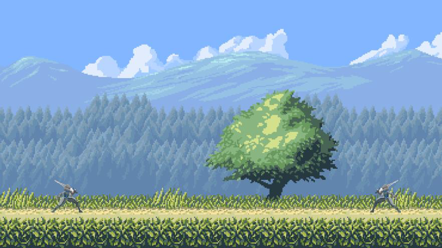
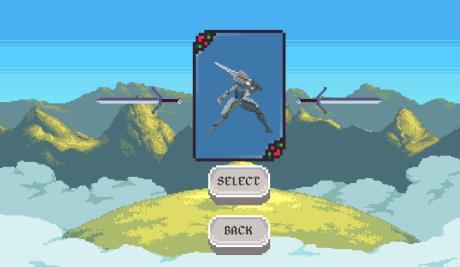
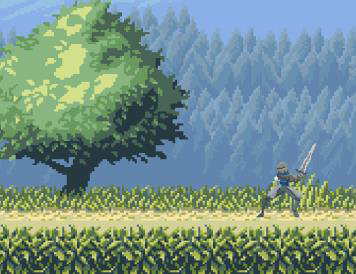
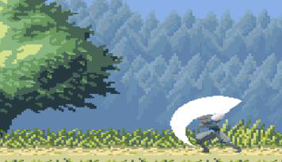
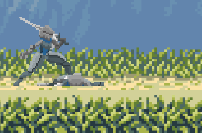

# RPG Game Project

Welcome to the RPG Game project repository! This project was developed as part of a C++ programming course, utilizing various tools and libraries to create a functional and engaging role-playing game (RPG).

## Project Overview

This project involves the creation of a basic RPG game using C++ and the SDL library. The game includes features such as a game menu, character selection, movement mechanics, and combat with attack and damage systems.

## Screen Shots

## Tools Used

### SDL Library

The Simple DirectMedia Layer (SDL) is a free and open-source software library that allows developers to create multimedia applications, including video games, video applications, and audio applications. SDL provides an interface for handling input devices, rendering graphics, and managing audio.

### Character Selection Menu

The character selection menu allows players to choose their character using arrow images for navigation and buttons for selection and returning to the main menu.

### Character Movement

Character movement is controlled using keyboard inputs:
- Player 1 uses "Q" and "D" keys to move left and right.
- Player 2 uses the Left and Right arrow keys for movement.
- SDL_GetKeyboardState() is used to get real-time keyboard state for smooth and responsive movements.

### Attack and Damage

Attack mechanics are implemented with:
- Player 1 attacks using the "K" key.
- Player 2 attacks using the Space key.
- An animation is displayed during attacks, and character health decreases upon collision detection.

